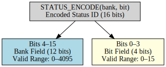

# status

A lightweight C11 status register library for embedded systems.
Tracks faults, warnings, and info bits using banked bitfields encoded as compact 16-bit status IDs.

## Features

- **Banked bitfields** - Efficient storage using arrays of `uint16_t` across configurable banks
- **Compact IDs** - 16-bit IDs encode both bank and bit index via `STATUS_ENCODE`
- **Three status classes** - Separate fault, warning, and info registers
- **No dynamic memory** - Fixed-size operations, no `malloc` / `free`
- **Critical section hooks** - User-supplied macros for interrupt-safe access
- **Error callbacks** - Runtime notification of invalid IDs or null pointers
- **Snapshot API** - Bulk-copy registers for logging or diagnostics

## Installation

### Copy-in (recommended for embedded targets)

Copy two files into your project tree:

```
include/status.h
src/status.c
```

Then include the header:

```c
#include "status.h"
```

### Meson subproject

Add this repo as a wrap dependency or subproject:

```meson
status_dep = dependency('status', fallback : ['status', 'status_dep'])
```

## Quick Start

### 1. Define Status IDs

Create a `status_ids.h` for your application using the `STATUS_ENCODE` macro:

```c
/* status_ids.h */
#include "status.h"

// Bank 0: Power Faults
#define STATUS_ID_FAULT_OVERCURRENT    STATUS_ENCODE(0u, 0u)
#define STATUS_ID_FAULT_OVERVOLTAGE    STATUS_ENCODE(0u, 1u)

// Bank 1: Thermal Warnings
#define STATUS_ID_WARN_HIGH_TEMP       STATUS_ENCODE(1u, 0u)
```

Each bank holds 16 bits. `bank` must be less than `NUM_STATUS_BANKS`; `bit` must be 0–15.

### 2. Integrate

```c
#include "status_ids.h"

void app_init(void)
{
    status_init();

    /* Optional: register error callback */
    status_set_err_callback(my_error_handler);
}

void check_power(void)
{
    if (voltage > MAX_VOLTAGE) {
        status_set_fault(STATUS_ID_FAULT_OVERVOLTAGE);
    } else {
        status_clear_fault(STATUS_ID_FAULT_OVERVOLTAGE);
    }
}

void check_system(void)
{
    if (status_any(STATUS_CLASS_FAULT)) {
        /* at least one fault is active */
        uint16_t last = status_last_fault();
    }
}
```

## Configuration

All macros can be overridden before including the header (e.g. via compiler flags or a config header):

| Macro | Description | Default |
|---|---|---|
| `NUM_STATUS_BANKS` | Number of `uint16_t` banks per status class | `12` |
| `STATUS_ENTER_CRITICAL()` | Enter critical section (disable interrupts) | no-op |
| `STATUS_EXIT_CRITICAL()` | Exit critical section (restore interrupts) | no-op |

## Concurrency

The library performs read-modify-write operations on `volatile` arrays. These are **not** atomic on their own.

Define `STATUS_ENTER_CRITICAL` and `STATUS_EXIT_CRITICAL` to protect access whenever status bits are read or written from multiple execution contexts (e.g. ISR and main loop):

```c
#define STATUS_ENTER_CRITICAL()  __disable_irq()
#define STATUS_EXIT_CRITICAL()   __enable_irq()
```

## Building

```sh
# Library only (release)
meson setup build --buildtype=release
meson compile -C build

# With unit tests (default)
meson setup build --buildtype=debug
meson compile -C build
meson test -C build

# Disable tests
meson setup build -Dbuild_tests=false
```

## API Reference

### Lifecycle

```c
void status_init(void);
void status_set_err_callback(status_err_cb_t cb);
```

### Set / Clear / Toggle

```c
void status_set_fault(uint16_t id);
void status_set_warning(uint16_t id);
void status_set_info(uint16_t id);

void status_clear_fault(uint16_t id);
void status_clear_warning(uint16_t id);
void status_clear_info(uint16_t id);

void status_toggle_fault(uint16_t id);
void status_toggle_warning(uint16_t id);
void status_toggle_info(uint16_t id);
```

### Query

```c
bool status_is_fault_set(uint16_t id);
bool status_is_warning_set(uint16_t id);
bool status_is_info_set(uint16_t id);

bool status_any(enum status_class cls);
void status_clear_all(enum status_class cls);
```

### Last Set

```c
uint16_t status_last_fault(void);
uint16_t status_last_warning(void);
uint16_t status_last_info(void);
```

Returns the most recently set ID for that class. Does not reflect currently active bits — use `status_any()` for that.

### Snapshot

```c
void status_snapshot(enum status_class cls, uint16_t *dst, size_t len);
```

Copies all banks for the given class into `dst`. `len` must equal `NUM_STATUS_BANKS`.

### ID Encoding Helpers

`STATUS_ENCODE` packs a bank index and bit position into a single 16-bit value:



```c
#define STATUS_ENCODE(bank, bit)   /* compile-time: encode bank + bit → uint16_t */

static inline uint16_t status_bank(uint16_t id);  /* extract bank index */
static inline uint16_t status_bit(uint16_t id);   /* extract bit index  */
```

## Use Cases

1. **Fault management** - Track and query active faults in safety-critical control loops
2. **Warning escalation** - Separate warning state from hard fault state
3. **Diagnostics** - Snapshot registers for logging or transmission over CAN/UART
4. **State encoding** - Compact event/status flags in RTOS tasks or state machines
5. **ISR-safe signalling** - Set status bits from interrupt context with critical section hooks

## Notes

| Topic | Note |
|---|---|
| **Memory** | All storage is statically allocated; no heap use |
| **Thread safety** | Not thread-safe by default; supply `STATUS_ENTER_CRITICAL` / `STATUS_EXIT_CRITICAL` |
| **Error handling** | Invalid IDs invoke the registered error callback (if any) and are otherwise ignored |
| **Version header** | `status_version.h` is auto-generated by Meson and placed in the build output directory |
| **Status classes** | Three independent register sets: `STATUS_CLASS_FAULT`, `STATUS_CLASS_WARNING`, `STATUS_CLASS_INFO` |
